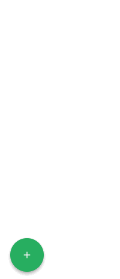

> A tiny (~1kb gzip) Floating Action Button for React

Want to use a Floating Action Button without having to import the whole Material Design Components library? Weighing in
at only around 1kb gzipped, React Tiny FAB is a great solution. It is a lightweight, fast, and flexible component.



## Install

```
npm install react-tiny-fab
yarn add react-tiny-fab
```

## Usage
There are two components available for import - `Fab` and `Action`. You import them like this:

```
import { Fab, Action } from 'react-tiny-fab';
import 'react-tiny-fab/styles.css';
```

Here is an example of how you would use the components:
```
<Fab
  mainButtonStyles={mainButtonStyles}
  actionButtonStyles={actionButtonStyles}
  position={position}
  icon={<MdAdd />}
  event={event}
>
  <Action
    text="Email"
    onClick={handleOnClick}
  >
    <MdEmail />
  </Action>
</Fab>
```

## Components
### `<Fab />` Component
This is the main component that controls the Floating Action Button.

#### `<Fab />` props
| Prop                 | Type                       | Default                   | Required | Description                                                                                                                                |
|----------------------|----------------------------|-------------------------- |----------|--------------------------------------------------------------------------------------------------------------------------------------------|
| `mainButtonStyles`   | React.CSSProperties object | {}                        | false    | This object is passed to the main button's `style` prop so use React styles to style the button.                                           |
| `position`           | object                     | `{ bottom: 0, right: 0 }` | false    | This is the lo-fi theme object that defines all styles for child components.                                                               |
| `icon`               | React Element/Component    |                           | true     | This element/component will be the used as the icon for the main button. This can be text, or a Font Awesome icon, or any other component. |
| `event`              | string                     | 'hover'                   | false    | What type of event do you want to make the FAB menu active? This can be either `click` or `hover`.                                         |
| `children`           | React Element/Component    |                           | false    | This is the children that will be mapped and rendered. This can be anything. There can be up to 6, but no more than 6. An `Action` component is provided out of the box.           |

### `<Action />` Component 
This component represents the smaller buttons that appear when the main button is hovered/clicked. Now, you do not have 
to use this component. You can use your own custom component(s) and create something totally different than a Floating
Action Button. For instance, you could create your own "Support Button" that when clicked, will display a chat box or 
some type of form that submits a contact request.

#### `<Action />` props
| Prop       | Type                    | Default | Required | Description                                                                  |
|------------|-------------------------|---------|----------|------------------------------------------------------------------------------|
| `text`     | string                  | ""      | false    | This is the text that will be displayed when one of the actions is hovered.  |
| `children` | React Element/Component |         | false    | This will be the icon/text for the action.                                   |

## Demo

## Contributing